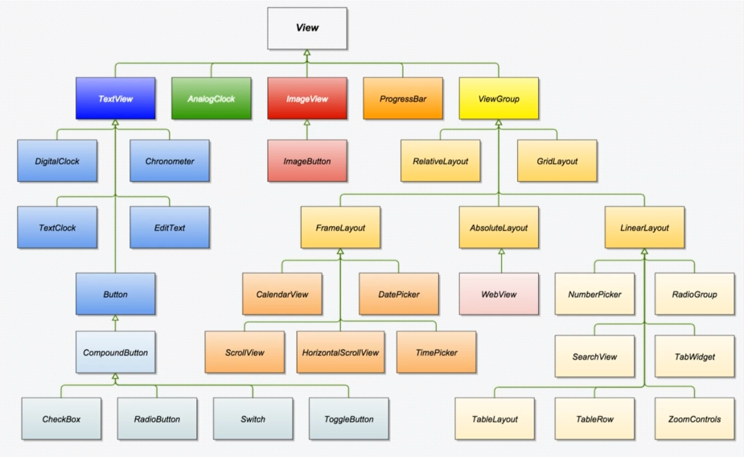
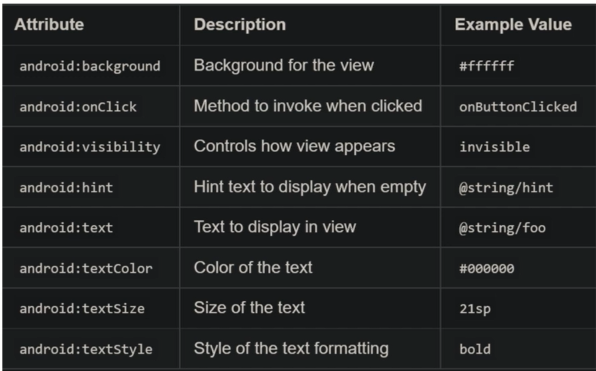

# Android-Application

## 7. View and Widget

    - View  là một đơn vị cơ bản của UI, có thể vẽ trên màn hình và tương tác với người dùng. đại diện cho một đối tượng UI như một nút (Button), một văn bản (TextView), một hình ảnh (ImageView), v.v

    - View Group là một container chứa các View con (hoặc thậm chí là các ViewGroup khác), tạo thành một cấu trúc phân cấp. ViewGroup là lớp cơ sở cho các layout và container trong Android, như LinearLayout, RelativeLayout, FrameLayout, ScrollView, v.v. ViewGroup quản lý layout và hiển thị của các View con bên trong nó, cho phép bạn tạo ra các giao diện phức tạp và có cấu trúc.

### View

    - Views thông thường : Hàng F1 ảnh trên.

    - Views Identifiers: Bất kể view nào cũng đều đính kèm 1 câu lệnh để định nghĩa, ví dụ: <Button android:id="@+id/my_button" />

    - Views High and Width: Cung cấp chiều cao, kích thước của view

    - Views Margin and Padding : lề, phần ngăn cách để chỉ vị trí, khoảng cách giữa các thành phần trong 1 layout

    - Views còn nhiều thuộc tính khác nữa như : 

